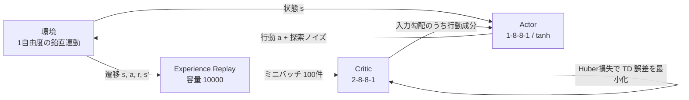

# DDPG from Scratch in C/C++

二足歩行ロボットの歩行制御を強化学習で獲得させることを目標に、深層強化学習アルゴリズム **DDPG (Deep Deterministic Policy Gradient)** を外部ライブラリを一切使わずゼロから実装したプロジェクトです。

行列演算・誤差逆伝播・Adam・Experience Replay まですべて自前で記述しており、依存しているのは C 標準ライブラリ（`stdio.h` / `stdlib.h` / `math.h` / `time.h` / `string.h`）のみです。連続値の行動を出力するエージェントが、重力に逆らって機体を支える 1 自由度の自作物理環境で制御を学習します。

```text
mean_reward:0.302361
qnet_loss:0.000000
mean_reward:0.334986
...
mean_reward:0.395442
...
seq[-0.145060 ]p_seq[-0.942002 ]action[0.970365 ]reward[0.485494]
```

1000 ステップごとの平均報酬が 0.30 から 0.40 付近へ改善し、学習が成立していることを確認しています（報酬の理論上の最大値は 0.5）。

## 開発の背景・目的

最終的な目標は、**二足歩行ロボットの歩行動作を強化学習で獲得させること**でした。物理演算には ODE ベースの二足歩行ロボットシミュレータ「[Go Simulation!](http://go-simulation.com/)」（ROBO-ONE on PC 公式ソフトウェア）を用い、同ソフトのスクリプトによる行動制御機能に自作の学習器を接続する構想で進めていました。

歩行制御では関節の数だけ行動次元が増え、各関節へ連続値のトルク指令を与える必要があります。行動を離散化する DQN 系の手法では現実的に扱えないため、連続行動を直接出力できる DDPG を選択しました。

ただし、いきなり多関節の歩行タスクへ適用すると、**学習が進まない原因が「アルゴリズムの実装ミス」なのか「タスクの難しさ」なのか切り分けられません**。そこで本リポジトリでは、まず推力と重力の釣り合いを学習する 1 自由度の環境を自作し、

- 自作ニューラルネットワークの誤差逆伝播が正しく計算できているか
- Critic から Actor へ勾配を受け渡す DDPG の中核が機能しているか
- Experience Replay が学習を安定させているか

を検証する段階まで実装しました。

また、シミュレータや学習フレームワークに依存しない形で学習器を保持し、将来的にシミュレータ側へ組み込めるようにするため、Python や既存の深層学習フレームワークを使わず C/C++ で書き下しています。

## 使用技術

| 分類 | 内容 |
| --- | --- |
| 言語 | C++（クラス・STL・例外を使わない C99 スタイル。生ポインタと `malloc` / `calloc`、`struct` ベース） |
| ビルド | Visual Studio 2017 (MSVC v141) / Windows SDK 10.0.16299、CMake 3.15 以降 |
| 対応構成 | Debug・Release × Win32・x64、および CMake 経由での Windows / Linux / macOS |
| 外部ライブラリ | なし（数値計算・線形代数・自動微分もすべて自作） |
| アルゴリズム | DDPG (Lillicrap et al., 2015)、Adam、Huber 損失、Experience Replay |
| 連携想定先 | Go Simulation!（二足歩行ロボット用 3D 物理演算シミュレータ、ODE ベース） |

## 主な機能・実装したこと

### 1. ニューラルネットワーク基盤（自作）

`unit.cpp` に、深層学習フレームワークが提供する機能を一から実装しています。

- **任意の層構成**: `init_net(len, batch, sizes)` に層サイズの配列を渡すだけで、層数・ユニット数が異なるネットワークを構築
- **全結合層**: 順伝播 `linear()` と、逆伝播を「重みの勾配」「バイアスの勾配」「入力の勾配」の 3 つに分割した `linear_back_weight()` / `linear_back_bias()` / `linear_back_in()`
- **活性化関数**: LeakyReLU（負側の傾き 0.2）、Sigmoid、tanh と、それぞれの微分
- **損失関数**: 平均二乗誤差と Huber 損失、およびそれぞれの微分
- **最適化手法**: SGD と、バイアス補正付きの Adam（`lr = 0.001`, `β1 = 0.9`, `β2 = 0.999`）
- **ミニバッチ学習**: 全テンソルを `batch × row` の 1 次元 `double` 配列として扱い、バッチサイズを実行時に変更可能

### 2. DDPG エージェント

| 要素 | 構成 |
| --- | --- |
| Actor（方策） | 1 - 8 - 8 - 1、隠れ層 LeakyReLU、出力層 tanh で行動を [-1, 1] に収める |
| Critic（行動価値） | 2 - 8 - 8 - 1（状態 1 次元 + 行動 1 次元を結合して入力）、出力は線形 |
| Experience Replay | 容量 10000 のリングバッファ。`(s, a, r, s')` を保存し、ミニバッチ 100 件を無作為抽出 |
| 目標値 | `target = r + γ Q(s', μ(s'))`（`γ = 0.95`）を Huber 損失で回帰 |
| 探索 | 行動に一様乱数ノイズを加算。振幅 α を 2.0 から 1 ステップあたり 1/2000 ずつ減衰させ 0 まで（探索から活用への移行） |

Actor の更新では、**Critic の入力層で求まった勾配 `dx` のうち行動次元に対応する成分だけを切り出し**、それを Actor の出力側の勾配として逆伝播させています（`update_p_and_q()`）。これが DDPG の中核であり、本実装で最も検証したかった部分です。

### 3. 物理環境（自作）

質量 1 の機体に、行動から決まる推力と重力が働く 1 自由度の系です。脚の伸展で機体を支える動作の最小構成に相当します。

```text
f = action × 50 − 9.8      (推力 − 重力)
v ← v + f / m              (速度の更新)
x ← x + v × 0.01           (位置の更新)

reward = (5 − |x|) / 10    ただし負になる場合は −1 を与えて原点にリセット
```

原点付近を保つほど高い報酬が得られるため、エージェントは重力とちょうど釣り合う推力を学習する必要があります。

### 4. 学習ループとログ

10 エポック × 1000 ステップの学習を実行し、エポックごとに平均報酬と Critic の損失を出力します。終了後、学習済み Actor の出力と、リプレイバッファ末尾 1000 件の遷移を確認用に表示します。

## アーキテクチャ



モジュールは以下の 4 層に分けて実装しており、`unit.h` の宣言順序もこの階層に沿わせています。

```text
数値計算プリミティブ   linear / 活性化関数 / 損失関数 / SGD・Adam
        ↓
ネットワーク単位の処理  Qnetwork_predict / Pnetwork_predict / Qnetwork_train / Pnetwork_train
        ↓
エージェントの更新     random_data / update_p_and_q
        ↓
環境と行動選択         updatestate / get_action
```

## こだわった点・工夫した点

- **逆伝播の意図的な 3 分割**
  一般的な実装では逆伝播を 1 つの関数にまとめますが、DDPG では「Critic の入力に対する勾配」を Actor 側へ流す必要があります。そのため `linear_back_weight` / `linear_back_bias` / `linear_back_in` を独立した関数として設計し、入力勾配だけを単体で取り出せる API にしました。

- **責務の分離**
  数値計算のプリミティブ、ネットワーク単位の推論・学習、エージェントの更新則、環境を明確に分離しました。ネットワークは層サイズの配列を渡すだけで構築できるため、Actor と Critic を同じコードで扱えます。歩行タスクへ拡張する際に環境部分の差し替えだけで済むことを意図した構造です。

- **メモリレイアウトの統一**
  多次元配列やポインタのポインタを使わず、すべてのテンソルを `batch × row` の 1 次元 `double` 配列に統一しました。インデックス計算が明示的になるためデバッグが容易で、連続領域に確保されるためキャッシュ効率にも有利です。

- **バッチサイズ変更の検知**
  学習時（バッチ 100）と行動選択時（バッチ 1）でバッチサイズが変わります。ネットワークごとに `id` を持たせ、バッチサイズが変化したときだけ中間バッファを再確保する遅延初期化により、同じネットワークを両方の用途で使い回せるようにしました。

- **損失関数の選択**
  平均二乗誤差も実装したうえで、Critic には Huber 損失を採用しました。ブートストラップで求めた目標 Q 値に外れ値が混じった際、二乗誤差では勾配が過大になり学習が発散しやすいためです。

## 既知の課題・今後の改善点

ポートフォリオとして公開するにあたり、現時点で把握している問題点を明記します。

- **Go Simulation! との連携が未実装**: 本来の目標である歩行制御には到達しておらず、1 自由度の自作環境での検証段階に留まっています。多関節へ拡張する際は、行動次元の増加に伴う探索効率の低下に対する工夫（Ornstein-Uhlenbeck 過程によるノイズなど）が必要です。
- **Target Network が未実装**: 原論文の soft update（`τ` による緩やかな追従）を省略し、学習中のネットワーク自身で目標 Q 値を計算しています。目標値が更新ごとに動くため、学習が不安定になりやすい構造です。
- **リプレイバッファのサンプリングにバグ**: `random_data()` の `(int)Uniform() * e.size` はキャストの優先順位により常に 0 となり、実質的に同一の遷移を 100 件サンプリングしています。正しくは `(int)(Uniform() * e.size)` です。ログの `qnet_loss` がほぼ 0 に張り付くのはこの影響で、Critic が同一データに完全にフィットしてしまっているためです。
- **Actor へ渡す勾配のインデックス誤り**: `update_p_and_q()` の `de[z - e.s_size]` がバッチのループ内で毎回同じ位置へ書き込まれており、バッチ全体の勾配が最後の 1 件で上書きされています。
- **tanh の実装の符号**: `tanh_()` が `tanh(-x)` と符号を反転しており、その微分 `tanh_back()` にも余分な係数が掛かっています。
- **重み初期化**: Box-Muller 法による正規乱数生成 `rand_normal()` を実装済みですが `ramdom()` 内でコメントアウトされたままで、実際には一様分布 U(0, 1) で初期化しています。He 初期化や Xavier 初期化へ切り替えるべき箇所です。
- **メモリ管理**: バッファ再確保時に旧領域を `free()` しておらずリークします。また終了時の解放処理も実装していません。
- **乱数の初期化位置**: `ramdom()` が呼ばれるたびに `srand(time(NULL))` を実行するため、同一秒内に複数のネットワークを初期化すると同じ重みが生成されます。
- **テストの不足**: 数値微分と解析的勾配を比較する勾配チェックなど、ユニットテストを用意していません。

## 環境構築・起動手順

### CMake（Windows / Linux / macOS）

```bash
cmake -S . -B build -DCMAKE_BUILD_TYPE=Release
cmake --build build
./build/ddpg
```

### g++ で直接ビルド

```bash
g++ -std=c++11 -O2 -I DDPG/DDPG DDPG/DDPG/main.cpp DDPG/DDPG/unit.cpp -o ddpg -lm
./ddpg
```

### Visual Studio 2017

1. `DDPG/DDPG.sln` を開く
2. 構成を `Release` / プラットフォームを `x64` に設定
3. <kbd>Ctrl</kbd> + <kbd>F5</kbd> でビルドと実行

いずれの手順でも追加のライブラリ導入は不要です。実行するとエポックごとの平均報酬と Critic の損失が標準出力に表示されます（実行時間は数秒程度）。

## ディレクトリ構成

```text
.
├── CMakeLists.txt          クロスプラットフォーム用ビルド定義
├── README.md
└── DDPG/
    ├── DDPG.sln            Visual Studio 2017 ソリューション
    └── DDPG/
        ├── DDPG.vcxproj    プロジェクト定義
        ├── main.cpp         学習ループのエントリポイント
        ├── unit.h           ネットワーク・環境・エージェントの宣言
        ├── unit.cpp          上記すべての実装（順伝播・逆伝播・Adam・DDPG）
        ├── stdafx.h / stdafx.cpp   プリコンパイル済みヘッダー
        └── targetver.h      Windows SDK のターゲットバージョン指定
```

## 参考文献

- Timothy P. Lillicrap et al., "Continuous control with deep reinforcement learning", ICLR 2016. [arXiv:1509.02971](https://arxiv.org/abs/1509.02971)
- Diederik P. Kingma, Jimmy Ba, "Adam: A Method for Stochastic Optimization", ICLR 2015. [arXiv:1412.6980](https://arxiv.org/abs/1412.6980)
